  

  

<picture>
  <source media="(prefers-color-scheme: dark)" srcset="https://raw.githubusercontent.com/samriddha-gautam/samriddha-gautam/output/github-snake-dark.svg">
  <source media="(prefers-color-scheme: light)" srcset="https://raw.githubusercontent.com/samriddha-gautam/samriddha-gautam/output/github-snake.svg">
  
</picture>
